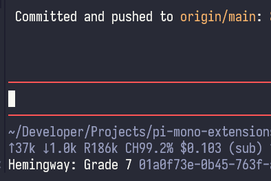

# pi-hemingway-output-readability-score

A Pi plugin that shows the English readability grade of the final assistant reply in the footer.

## Features

- Displays `Hemingway: Grade N` using the [Automated Readability Index (ARI)](https://en.wikipedia.org/wiki/Automated_readability_index), not [Flesch–Kincaid](https://en.wikipedia.org/wiki/Flesch%E2%80%93Kincaid_readability_tests).
- Calculates `4.71 × (characters / words) + 0.5 × (words / sentences) − 21.43`; Flesch–Kincaid uses syllables rather than characters.
- Rounds to the nearest integer and clamps at zero; standard ARI rounds up.
- Scores the whole final reply, excluding thinking, tool calls and incomplete responses.
- Clears the score during generation and updates when the agent finishes.
- Refreshes on reload, session changes and tree navigation.
- Runs locally without model calls, downloads or API keys.
- Leaves the assistant's text unchanged.